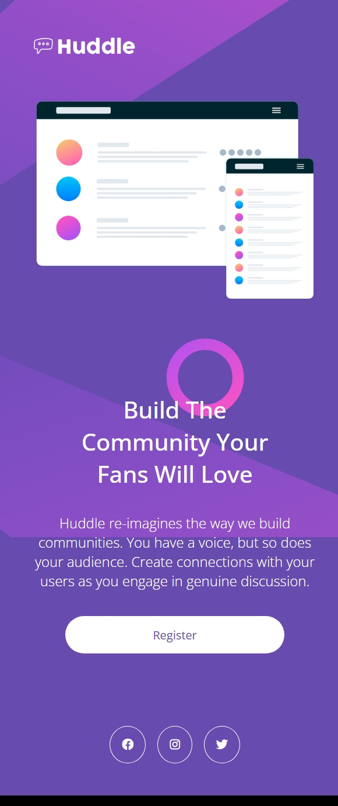
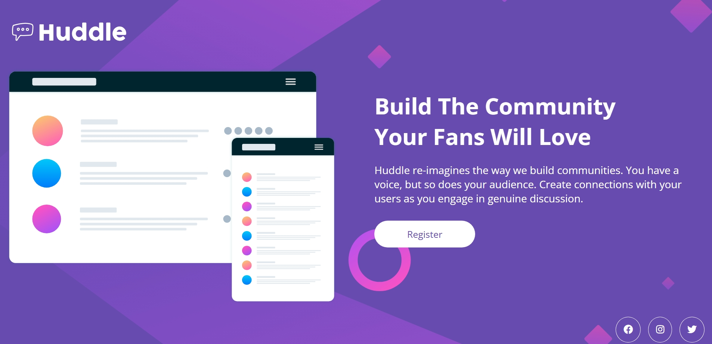

# 📌 HUddle Landing Page Responsiva

Este é um projeto do Frontend Mentor **Huddle landing page with a single introductory section**, desenvolvido com **HTML e CSS**. O design foi pensado para ser moderno, elegante e acessível, garantindo uma boa experiência em diferentes dispositivos.

## ✨ Tecnologias Utilizadas

- **HTML5** → Estrutura semântica da página
- **CSS3** → Estilização e responsividade

## 📌 Funcionalidades

✔️ Design responsivo para diversos tamanhos de tela   
✔️ Acessibilidade aprimorada  


## 📷 Preview

### 📱 Versão Mobile


### 💻 Versão Web


## 🚀 Como executar o projeto

1. Clone este repositório:
   ```bash
   git clone https://github.com/Milaregner/huddle-landing-page.git
   ```

2. Abra o arquivo `index.html` no navegador.


## 💜 Criado por

Feito com 💜 por [@Milaregner](https://github.com/Milaregner).  
Se gostou do projeto, deixe uma ⭐ no repositório!

---

💡 *Sugestões e melhorias são sempre bem-vindas!*
